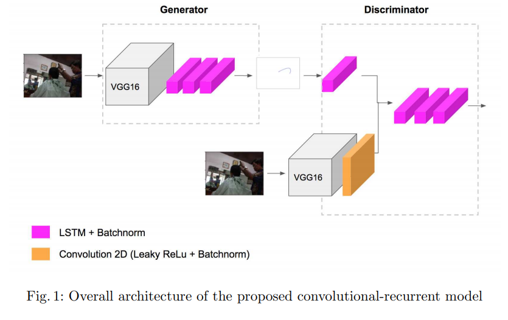

# More Research on Other Approaches
* [BeCAPTCHA-Mouse: Synthetic Mouse Trajectories and Improved Bot Detection](https://arxiv.org/pdf/2005.00890.pdf)
  * Discriminator
    * 2 LSTM Layers
    * Dense layer for classification
  * Generator
    * 2 LSTM Layers
    * 1 Layer for building the mouse trajectory
    * Analogous to a recurrent autoencoder?
  * __Training details:__
    * learning rate α = 2×10−4
    * Adam optimizer with β1 = 0.5, β2 = 0.999, e = 10−8
    * 50 epochs with a batch size of 128 samples for both Generator and Discriminator
    * The loss function was `binary crossentropy` for the Discriminator and `mean square error` for the Generator.
* Are CTRNNs related to C-RNN-GAN?
  * https://neat-python.readthedocs.io/en/latest/ctrnn.html
* [PathGAN](https://openaccess.thecvf.com/content_ECCVW_2018/papers/11133/Assens_PathGAN_Visual_Scanpath_Prediction_with_Generative_Adversarial_Networks_ECCVW_2018_paper.pdf)
  * Looks like:
    
  * Generator:
    * Finally, a recurrent module composed of 3 fully connected LSTMs with tanh activation and 1,000 hidden units is used to generate a variable length scanpath. Batch normalization layers are placed after each recurrent layer to improve convergence and accelerate learning.
* Batch Normalization for LSTMs?
  * can do for `return_sequences=False`
  ```
  model = Sequential()
  model.add(Bidirectional(LSTM(128, activation=None), input_shape=(256,10)))
  model.add(BatchNormalization())
  ```
  * can't do for `return_sequences=True`
    * Need to use a special recurrent BN
    * https://github.com/cooijmanstim/recurrent-batch-normalization
    * tf < 2
      * https://github.com/OlavHN/bnlstm/blob/master/lstm.py
    * [Layer Normalization should make more sense.](https://stackoverflow.com/questions/46915354/how-to-implement-tensorflow-batch-normalization-in-lstm)
      * [tf-addons(`tfa`) implementation](https://www.tensorflow.org/addons/api_docs/python/tfa/rnn/LayerNormLSTMCell)
## Datasets
* https://github.com/balabit/Mouse-Dynamics-Challenge
*
