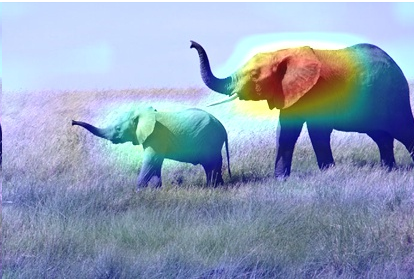

# Saliency Maps

## [GradCAM](https://arxiv.org/pdf/1610.02391.pdf)
This method's accuracy (at being an model interpretability tool) is supported by [Sanity Checks for Saliency Maps](https://arxiv.org/pdf/1810.03292.pdf), unlike guided backprop.

### Intuition
The intuition behind the algorithm is based upon the fact that the model must have seen some pixels (or regions of the image) and decided on what object is present in the image. __Influence__ in the mathematical terms can be described with a __gradient__.

On the high-level, that is what the algorithm does:
1. It starts with finding the gradient of the most __dominant logit__ with respect to the latest activation map in the model.
  * We can interpret this as __some encoded features that ended up activated in the final activation map persuaded the model as a whole to choose that particular logit__ (subsequently the corresponding class).
2. The gradients are then pooled channel-wise, and the activation channels are weighted with the corresponding gradients, yielding the collection of __weighted activation channels.__
  * __By inspecting these channels, we can tell which ones played the most significant role in the decision of the class.__

### General Steps
1. Load the model.
2. Find its last convolutional layer.
3. Compute the most probable class
4. Take the gradient of the class logit with respect to the activation maps we have just obtained
5. Pool the gradients
6. Weight the channels of the map by the corresponding pooled gradients
7. Interpolate the heat-map to match the input image size.

### What does that look like in code?
Since PyTorch does not store gradients in memory, we need to use `hooks` to compute the intermediate gradients for the last conv layer. It looks like this (in a `torch.nn.Module`):
```
# hook for the gradients of the activations
def activations_hook(self, grad):
    self.gradients = grad

def forward(self, x):
    x = self.features_conv(x)

    # register the hook after last conv
    h = x.register_hook(self.activations_hook)

    # apply the remaining pooling
    x = self.max_pool(x)
    x = x.view((1, -1))
    x = self.classifier(x)
    return x

# method for the gradient extraction
def get_activations_gradient(self):
    return self.gradients

# method for the activation exctraction
def get_activations(self, x):
    return self.features_conv(x)
```
Then, do a forward pass and backward pass. During the backward pass:
```
# get the gradient of the dominant logit, which is 386 in this case.
pred[:, 386].backward()

# pull the gradients out of the model
gradients = vgg.get_activations_gradient()

# pool the gradients across the channels (avg for each channel)
pooled_gradients = torch.mean(gradients, dim=[0, 2, 3])

# get the activations of the last convolutional layer
activations = vgg.get_activations(img).detach()
```
To weight the activation maps with the pooled gradients:
```
# weight the channels by corresponding gradients
for i in range(512):
    activations[:, i, :, :] *= pooled_gradients[i]
```
Lastly, to get the heatmap, we average the weighted activations:
```
# average the channels of the activations
heatmap = torch.mean(activations, dim=1).squeeze()
```
You can interpolate (resize) this heatmap to overlap with the input image to get a pretty result.



### Sources
* [Implementing Grad-CAM in PyTorch](https://medium.com/@stepanulyanin/implementing-grad-cam-in-pytorch-ea0937c31e82)

## Guided Backpropagation
