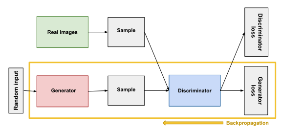

# GANs (Generative Adversarial Networks)

## What are generative models?
* `Generative` models can generate new data instances.
* `Discriminative` models discriminate between different kinds of data instances.

A generative model could generate new photos of animals that look like real animals, while a discriminative model could tell a dog from a cat. GANs are just one kind of generative model.

More formally, given a set of data instances X and a set of labels Y:
* `Generative models` capture the joint probability p(X, Y), or just p(X) if there are no labels.
* `Discriminative models` capture the conditional probability p(Y | X).

A generative model includes the distribution of the data itself, and __tells you how likely a given example is.__ For example, models that predict the next word in a sequence are typically generative models (usually much simpler than GANs) because they can assign a probability to a sequence of words.

A discriminative model ignores the question of whether a given instance is likely, and __just tells you how likely a label is to apply to the instance.__

## Overview of GAN Structure
* The `generator` learns to generate plausible data. The generated instances become negative training examples for the discriminator.
* The `discriminator` learns to distinguish the generator's fake data from real data. The discriminator penalizes the generator for producing implausible results.

## The Discriminator
The discriminator in a GAN is simply a classifier. It tries to distinguish real data from the data created by the generator. It could use any network architecture appropriate to the type of data it's classifying.

__The discriminator's training data comes from two sources:__
* __Real data instances__, such as real pictures of people. The discriminator uses these instances as positive examples during training.
* __Fake data instances__ created by the generator. The discriminator uses these instances as negative examples during training.

### Training the Discriminator
The discriminator connects to two loss functions. During discriminator training, the discriminator ignores the generator loss and just uses the discriminator loss. We use the generator loss during generator training, as described in the next section.

__During discriminator training:__
The discriminator classifies both __real data__ and __fake data from the generator.__ The discriminator loss penalizes the discriminator for misclassifying a real instance as fake or a fake instance as real. The discriminator updates its weights through backpropagation from the discriminator loss through the discriminator network.

## The Generator
The generator part of a GAN learns to create fake data by incorporating feedback from the discriminator. It learns to make the discriminator classify its output as real.

Generator training requires tighter integration between the generator and the discriminator than discriminator training requires. The portion of the GAN that trains the generator includes:
* random input
  * __Experiments suggest that the distribution of the noise doesn't matter much,__ so we can choose something that's easy to sample from, like a __uniform distribution.__ For convenience the space from which the noise is sampled is usually of smaller dimension than the dimensionality of the output space.
* generator network, which transforms the random input into a data instance
* discriminator network, which classifies the generated data discriminator output
* __generator loss, which penalizes the generator for failing to fool the discriminator__

### Using the Discriminator to Train the Generator
To train a neural net, we alter the net's weights to reduce the error or loss of its output. In our GAN, however, the __generator is not directly connected to the loss that we're trying to affect.__

The generator feeds into the discriminator net, and the discriminator produces the output we're trying to affect. The generator loss penalizes the generator for producing a sample that the discriminator network classifies as fake. So, backpropagation starts at the output and flows back through the discriminator into the generator.

At the same time, we don't want the discriminator to change during generator training (we don't want it to be trainable for generator training). Trying to hit a moving target would make a hard problem even harder for the generator.

__So we train the generator with the following procedure:__
1. Sample random noise.
2. Produce generator output from sampled random noise.
3. Get discriminator "Real" or "Fake" classification for generator output.
4. Calculate loss from discriminator classification.
5. Backpropagate through both the discriminator and generator to obtain gradients.
6. Use gradients to change only the generator weights.

## GAN Training
Because a GAN contains two separately trained networks, its training algorithm must address two complications:
* GANs must juggle two different kinds of training (generator and discriminator).
* GAN convergence is hard to identify.

### Alternating Training
GAN training proceeds in alternating periods:
1. The discriminator trains for one or more epochs.
2. The generator trains for one or more epochs.
3. Repeat steps 1 and 2 to continue to train the generator and discriminator networks.

__We keep the generator constant during the discriminator training phase.__ As discriminator training tries to figure out how to distinguish real data from fake, it has to learn how to recognize the generator's flaws. That's a different problem for a thoroughly trained generator than it is for an untrained generator that produces random output.

__Similarly, we keep the discriminator constant during the generator training phase.__ Otherwise the generator would be trying to hit a moving target and might never converge.

### Convergence
As the generator improves with training, the discriminator performance gets worse because the discriminator can't easily tell the difference between real and fake. If the generator succeeds perfectly, then the discriminator has a 50% accuracy. __In effect, the discriminator flips a coin to make its prediction.__

This progression poses a problem for convergence of the GAN as a whole: __the discriminator feedback gets less meaningful over time.__ If the GAN continues training past the point when the discriminator is giving completely random feedback, then the generator starts to train on junk feedback, and its own quality may collapse.

## Other resources:
* https://developers.google.com/machine-learning/gan/loss
* https://developers.google.com/machine-learning/gan/problems
* https://developers.google.com/machine-learning/gan/applications

## [Do GANs really model the true data distribution, or are they just cleverly fooling us?](https://towardsdatascience.com/do-gans-really-model-the-true-data-distribution-or-are-they-just-cleverly-fooling-us-d08df69f25eb)
* The evaluation of GANs forces us to resort to qualitative measures of “good of fit”.
* When GANs are trained on big datasets, visually compelling & diverse output don’t, by themselves, prove GAN training was successful in recovering the true data distribution. There is need more rigorous evidence that GANs do more than just “intelligent memorization” of the training set.
* When possible, opt for semantic similarity rather than simply using Euclidean distance on the raw data (especially if you’re trying to make a meaningful point)
