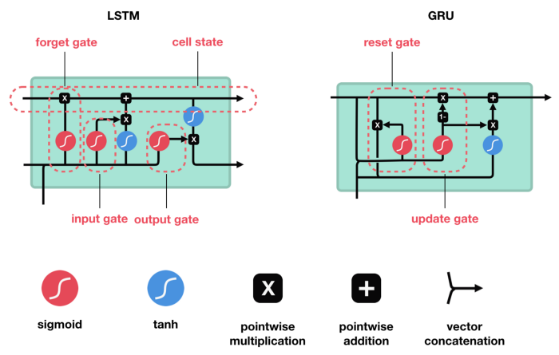
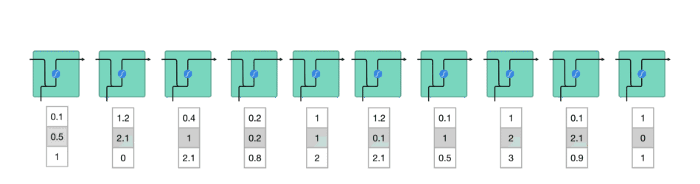
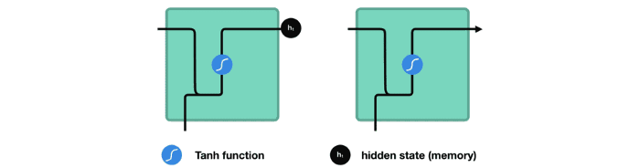
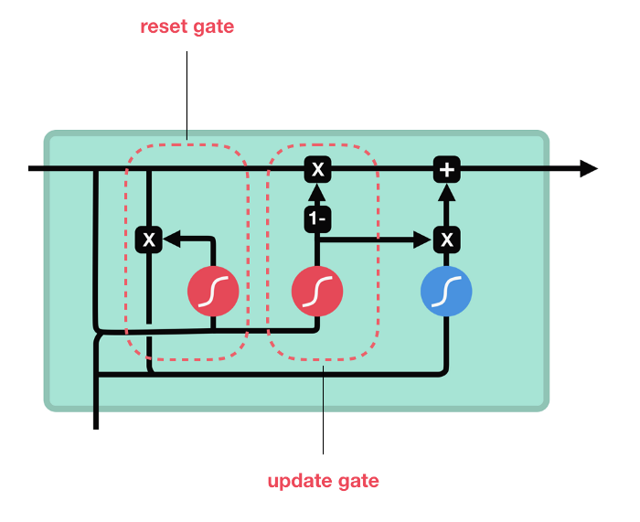

# RNN/LSTM Notes

* This goes over the intuition and the components of each NN/unit.
* The math discussed here is simple (doesn't include the actual equations or backprop calculations).

---

# TLDR;

### RNN
* Simplest form of the NNs discussed
* Mainly used for processing sequence and time series data
* Stores sequence information through a __hidden state__, which is updated multiplicatively (actually a linear combination of the weights, the input, and the previous hidden state).
* Susceptible to vanishing gradients to the hidden state being "multiplied."
  * Exploding gradients are not as big of problem.

### LSTM
* Aims to solve the vanishing gradient problem through the introduction of __cell states and gates.__
  * Don't solve the exploding gradients problem, so use gradient clipping if need be.
* Cells states also capture sequence information like hidden states, but are updated additively (with the outputs of the gates).
  * The hidden state is updated with the cell state, the input and previous hidden state.
* Another view is that the cell states capture long term information while the hidden states only capture short-term information. However, when the cell state is added to the hidden state, the cell state combines long-term information with the short-term.

### GRU
* Simpler version of an LSTM cell.
* No cell state (only hidden state).

---

# [Illustrated Guide to LSTM’s and GRU’s: A step by step explanation](https://towardsdatascience.com/illustrated-guide-to-lstms-and-gru-s-a-step-by-step-explanation-44e9eb85bf21)

## The Problem, Short-term Memory
* RNNs suffer from short-term memory.
  * hard time carrying information from earlier time steps to later ones.
* RNNs also suffer from the vanishing gradient problem.

## LSTM’s and GRU’s as a solution
* Gates regulate the flow of information.
  * The gates learn what information is relevant or not



## Review of Recurrent Neural Networks
* An RNN works like this; First words get transformed into machine-readable vectors. Then the RNN processes the sequence of vectors one by one.



* While processing, it __passes__ the previous hidden state to the next step of the sequence. The __hidden state__ acts as the neural networks memory. It holds information on previous data the network has seen before.



* __To calculate the hidden state:__
1. The input and previous hidden state are concatenated to form a vector.
2. The vector goes through the `tanh` activation
3. Output is the new hidden state.

__Note:__ The hidden state is usually initialized to 0s. OR [random noise for small datasets of long sequences](https://r2rt.com/non-zero-initial-states-for-recurrent-neural-networks.html)


## tanh function
* Squishes values between [-1, 1].

So that’s an RNN. It has very few operations internally but works pretty well given the right circumstances (like short sequences). __RNNs use a lot less computational resources than it’s evolved variants, LSTM’s and GRU’s.__

## LSTM
* The differences are the operations within the LSTM’s cells.


### Core Concept
* The core concept of LSTM’s are the cell state, and its various gates.
  * __cell state:__ acts as a transport highway that transfers relative information all the way down the sequence chain.
    * cell state v. hidden state?

### Sigmoid
* Gates contains sigmoid activations.
  * Squishes between [0, 1]
  * That is helpful to update or forget data because any number getting multiplied by 0 is 0, causing values to disappears or be “forgotten.”

### Forget gate
* Information from the previous hidden state and information from the current input is passed through the `sigmoid` function. Values come out between 0 and 1. The closer to 0 means to forget, and the closer to 1 means to keep.


### Input Gate
* Updates the cell state
1. Pass the previous hidden state & current input into a `sigmoid` function.
  * This decides which values will be updated, where [0 -> Not important, 1 -> important]
  * This is the actual `input layer`.
2. Pass the hidden state & current input into the `tanh` function, which regulates the scale of the network.
  * This is the `candidate layer` for returning the `candidate vector`.
3. Multiply the `tanh` output with the `sigmoid` output.
  * The sigmoid output acts as a weight for the importance through multiplication.
  * Also ends up deciding which information should be kept or deleted from the `tanh` output


### Cell State
* __To calulcate the cell state:__
  1. Multiplied by the forget vector.
    * Dropping irrelevant values in the cell state.
  2. Added with the output from the input gate.
    * Updates the cell state with new values that the NN finds relevant.


### Output Gate
* The output gate __decides what the next hidden state should be.__
  1. `O` = `sigmoid(concat(h, x))`
  2. `C` = `tanh(C)`
  3. `h` = `O * C`
* `O` acts as a mini forget gate.
* `C` is the cell state that is once again modified with `tanh` to regulate the scaling.
*  `h` is the new hidden state which is based on the new cell state and the previous hidden state.


### Pseudo Code
```
def LSTMCell(prev_ct, prev_ht, input):
  combine = concat(prev_ht, input)
  ft = forget_layer(combine)
  it = input_layer(combine)
  candidate = candidate_layer(combine)

  Ct = prev_ct * ft + candidate * it
  Ot = output_layer(combnine)
  ht = Ot * tanh(Ct)
  return ht, Ct

Ct = [0, 0, 0]
ht = [0, 0, 0]

for input in inputs:
  Ct, ht = LSTMCell(Ct, ht, input)
```

## GRU
* GRUs got rid of the cell state and used the hidden state to transfer information. It also only has two gates, a reset gate and update gate.



### Update Gate
* The update gate acts similar to the forget and input gate of an LSTM. It decides what information to throw away and what new information to add.

### Reset Gate
* The reset gate is another gate is used to decide how much past information to forget.

And that’s a GRU. GRU’s has fewer tensor operations; therefore, they are a little speedier to train then LSTM’s. There isn’t a clear winner which one is better. Researchers and engineers usually try both to determine which one works better for their use case.

---

# Questions
* [Why do we need both cell state and hidden value in LSTM networks?](https://stats.stackexchange.com/questions/341739/why-do-we-need-both-cell-state-and-hidden-value-in-lstm-networks)
  * LSTM/GRU cells solve the vanishing gradient problem by turning multiplication into addition. You have a cell state, and instead of multiplying you either add or subtract from it.
  * [LSTM decouples cell state (typically denoted by `c`) and hidden layer/output (typically denoted by `h`), and only do __additive updates__ to `c`, which makes memories in `c` more stable. Thus the gradient flows through `c` is kept and hard to vanish (therefore the overall gradient is hard to vanish). However, other paths may cause gradient explosion.](https://stats.stackexchange.com/questions/320919/why-can-rnns-with-lstm-units-also-suffer-from-exploding-gradients?noredirect=1&lq=1)
    * __Think:__ The cell state is an extra path that NNs can take to bypass multiplying too often, but vanishes the gradients.

* [__How can we say LSTM reduces chance of vanishing gradients?__ If gates allow long memory, vanishing gradients will also happen. If they don't and therefore they block long memory chains, how can we say we have long memory operation?](https://stats.stackexchange.com/questions/341739/why-do-we-need-both-cell-state-and-hidden-value-in-lstm-networks)
  * Vanishing/exploding gradients happen in LSTMs too.
    * In vanilla RNNs, the gradient is a term that depends on a factor exponentiated to `T` (`T` is the number of steps you perform backpropagation). This means that values greater than 1 explode and values less than 1 shrink very fast.
    * On the other hand, gradients in LSTMs, do not have a term that is exponentiated to `T`. Therefore, the gradient still shrinks/explodes, but at a lower rate than vanilla RNNs.

* Why is `tanh` used in RNNs instead of `ReLU`?
  * Better with dealing with exploding gradients because `tanh` is bounds values between [-1, 1] while `ReLU` is unbounded.
  * `tanh` still has a problem with vanishing gradients, but is better than most other activation functions when it comes to this issue.

* [When do we use GRUs over LSTMs?](https://datascience.stackexchange.com/questions/14581/when-to-use-gru-over-lstm)
  * From my experience, GRUs train faster and perform better than LSTMs on less training data if you are doing language modeling (not sure about other tasks).
  * GRUs are simpler and thus easier to modify, for example adding new gates in case of additional input to the network. It's just less code in general.
  * LSTMs should in theory remember longer sequences than GRUs and outperform them in tasks requiring modeling long-distance relations.

* Why do we need both the input and forget gate when the sigmoid in the input gate does the job of the forget gate?
  * Isn't it redundant?

* Draw diagram later.
---

# Other resources
* [Animated RNN, LSTM and GRU](https://towardsdatascience.com/animated-rnn-lstm-and-gru-ef124d06cf45)
* [Understanding LSTMs and GRUs](https://medium.com/towards-artificial-intelligence/understanding-lstms-and-gru-s-b69749acaa35)
* [What is the intuition behind separate activation/memory paths in LSTM's?](https://stats.stackexchange.com/questions/340584/what-is-the-intuition-behind-separate-activation-memory-paths-in-lstms)
* [LSTM vs GRU: Understanding the 2 major Neural Networks Ruling Character Wise Text Prediction](https://medium.com/datadriveninvestor/lstm-vs-gru-understanding-the-2-major-neural-networks-ruling-character-wise-text-prediction-5a89645028f0)
* [Gated Recurrent Unit (GRU) With PyTorch](https://blog.floydhub.com/gru-with-pytorch/)

---

__Goal:__  Predict sequence of grid coordinates with some time step, t.
* [Predicting sequence of grid coordinates with PyTorch](https://stackoverflow.com/questions/57091026/predicting-sequence-of-grid-coordinates-with-pytorch)
* [Deep Mouse](https://www.andreaamico.eu/supervised-learning/2019/06/15/deep_mouse.html)
