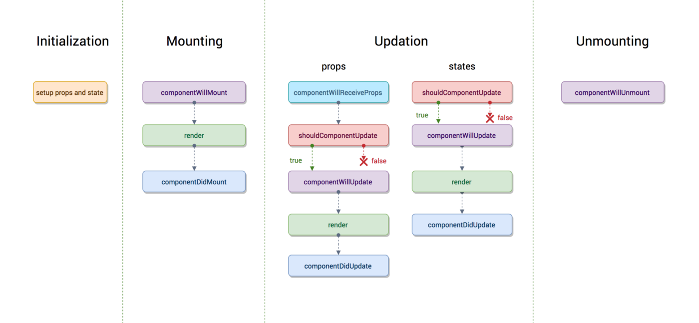
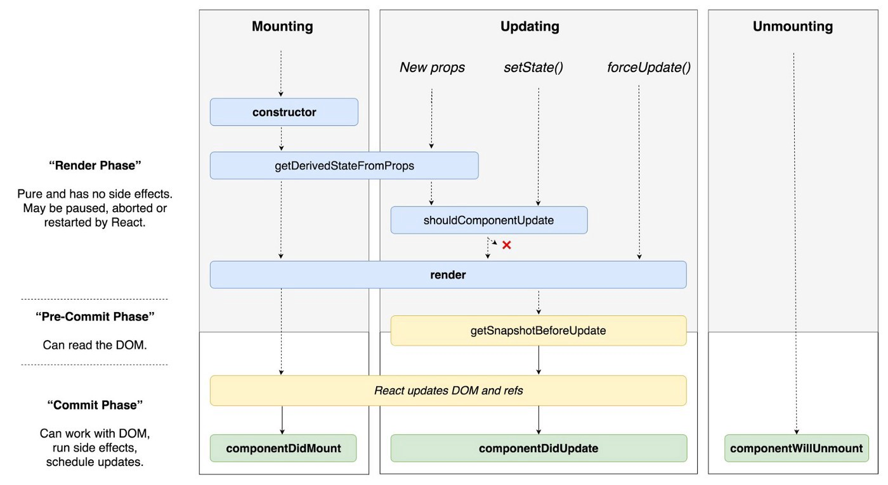

# [React-16 | New life-cycle methods inside out](https://medium.com/@saharshgoyal/react-16-new-life-cycle-methods-inside-out-fdd269c43ccd)

## Revisiting commonly used life-cycle methods

1. `shouldComponentUpdate(nextProps, nextState)`
  * lets you decide whether or not to re-render a component by returning `true` or `false`
  * Usually a condition is specified to check if the nextProps are different from the current state
  * `React.PureComponent` implements `shouldComponentUpdate()` with a shallow prop and state comparison for a performance boost
    * __shallow comparison is [iterating on the keys of the objects being compared and returning true when the values of a key in each object are not strictly equal.](https://reactjs.org/docs/shallow-compare.html)__
    * "shallow" as in not complex data structure
      * may produce false negatives for deeper differences
    * for deeper structures, you can use `forceUpdate()` or `immutable objects` or just regular `React.Component` with `shouldComponentUpdate`

2. `componentDidMount()`

3. `componentWillMount() / UNSAFE_componentWillMount()`

4. `componentWillReceiveProps() / UNSAFE_componentWillReceiveProps()`

5. `componentWillUpdate() / UNSAFE_componentWillUpdate()`

## New life-cycle methods in action

1. `static getDerivedStateFromProps(props, state)`

2. `getSnapshotBeforeUpdate(prevProps, prevState)`

## Takeaways
...
