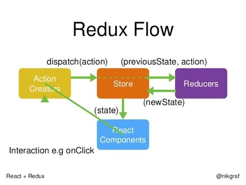

# [Redux v. React Context API](https://academind.com/learn/react/redux-vs-context-api/)
* Both for state management in React (i.e. skipping certain components in the hierarchy while passing the state)

## What is Redux?
* Main library for state management in React
* Consists of four major components:
  1. __Single, centralized state (like a global JS object)__ that is not directly accessible or mutable.
    * This is contained a `store`.
  2. __Reducer functions:__ contain the logic to __change and update__ the global state
    * returns a copy of the old state with all the required changes
  3. __Actions:__ passed to a reducer to be run on the global state
  4. __Subscriptions:__ get data out of the global state (i.e. to be used in React components)



## What is React’s Context API?
* Answers: "How can you manage state which you need in multiple, not directly connected components?"
* __Note:__ The Context API (currently) is [not built for high-frequency updates](https://github.com/facebook/react/issues/14110#issuecomment-448074060) (quote of Sebastian Markbage, React Team)


### The Context Object
```
import React from 'react'

export default React.createContext({}) // argument is the default starting value
```
* It's some data - e.g. a JavaScript object (could also be just a number or string etc) that is __shared across component boundaries.__ You can store any data you want in Context.

### Providing Context
* Context should be provided in a component that __wraps all child components that eventually need access to the Context.__
* For data that should be available in your entire app, you have to provide Context in your root component (e.g. `<App />`)

```
// Other imports...
import ShopContext from './path/to/shop-context'; // The path to the file where you called React.createContext()

class App extends Component {
  render() {
    return (
      <ShopContext.Provider value={{
          products: [],
          cart: []
        }
      }>
        {/*  Any child or child of a child component in here can access 'ShopContext'*/}
      </ShopContext.Provider />
    );
  }
}
```

### Consuming Context
#### Using `Context.Consumer`
```
// Other imports...
import ShopContext from '../context/shop-context'

class ProductsPage extends Component {
  render() {
    return (
      <ShopContext.Consumer>  { }
        {context => (
          <React.Fragment>
            <MainNavigation
              cartItemNumber={context.cart.reduce((count, curItem) => {
                return count + curItem.quantity
              }, 0)}
            />
            <main className="products">...</main>
          </React.Fragment>
        )}
      </ShopContext.Consumer>
    )
  }
}

export default ProductsPage
```
* __Note:___ `context` is an argument to a function that creates the JSX that constitutes the children of `<ShopContext.Consumer>`
* The `context` object is the __exact same object__ passed to value on our `<ShopContext.Provider>`
  * which means that when the data passed to `value` changes, the `context` object in the child component __also changes and hence this child component updates.__

#### Using `static contextType`
* can also get access to our Context by setting a static property in our (class-based) child component

```
// Other imports...
import ShopContext from '../context/shop-context'

class CartPage extends Component {
  static contextType = ShopContext

  componentDidMount() {
    // Advantage of static contextType: We can now also access Context in the rest of the component
    console.log(this.context)
  }

  render() {
    return (
      <React.Fragment>
        <MainNavigation
          cartItemNumber={this.context.cart.reduce((count, curItem) => {
            return count + curItem.quantity
          }, 0)}
        />
        <main className="cart">...</main>
      </React.Fragment>
    )
  }
}

export default CartPage
```
* Here, `static contextType = ShopContext` sets the value for `this.context`, allowing you to use the context freely throughout the object

### Updating State via Context
* TLDR; provides states as your arguments to `value` in `Context.Provider`.
