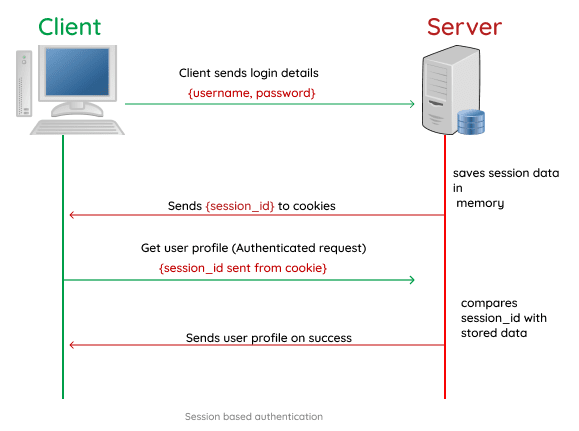
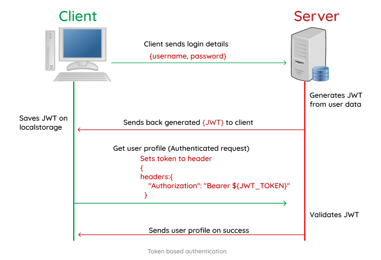

# JSON Web Tokens

# [Introduction to JSON Web Tokens](https://jwt.io/introduction/)
`JSON Web Token (JWT) is an open standard (RFC 7519) that defines a compact and self-contained way for securely transmitting information between parties as a JSON object.`
* __self-contained:__ independent, complete
* JWT is very compact (stateless, no sessions).

## Signed v. Encrypted Tokens
* Signed tokens can verify the integrity of the claims contained within it, while encrypted tokens hide those claims from other parties.
* When tokens are signed using public/private key pairs, the signature also certifies that only the party holding the private key is the one that signed it.
* can be signed using a secret (i.e. with HMAC) or a public/private key pair using RSA or ECDSA

## When should you use JWT?
* Authorization
  * allowing the user to access routes, services, and resources that are permitted with that token.
  * __Single Sign On__ (authentication scheme that allows a user to log in with a single ID and password to any of several related, yet independent, software systems) uses JWT
* Information Exchange
  * __Can ensure that the senders are who they say they are__ if signed with public/private key pairs
  * __Can ensure that the content has not been tampered with__ because signature is calculated using the header and the payload

## What is the JSON Web Token structure?
* Consists of `Header`, `Payload`, `Signature` that are separated by `.` (i.e. `xxxxx.yyyyy.zzzzz`)

### Header
Looks like:
```
{
  "alg": "HS256", // signing algo
  "typ": "JWT" // type of token
}
```
This JSON is Base64Url encoded to form the first part of the JWT.

### Payload
`The payload is the part of transmitted data that is the actual intended message.` The payload contains claims.

The types of claims are:
* __Registered claims:__ not mandatory, but recommended. I.e. `iss` (issuer), `exp` (expiration time), `sub` (subject), `aud` (audience), etc.
* __Public claims:__ can be defined at will by those using JWTs
* __Private claims:__ custom claims created to share information between parties that agree on using them and are neither registered or public claims
The possible JWT claims are in the [IANA JSON Web Token Registry](https://www.iana.org/assignments/jwt/jwt.xhtml).

Example payload looks like this:
```
{
  // three letters --> JWT is compact :)
  "sub": "1234567890",
  "name": "John Doe",
  "admin": true
}
```
The payload is then Base64Url encoded to form the second part of the JSON Web Token.

`Do note that for signed tokens this information, though protected against tampering, is readable by anyone. Do not put secret information in the payload or header elements of a JWT unless it is encrypted.
`
* This is because they can be decoded with the [JWT debugger](https://jwt.io/#debugger-io)

### Signature
`To create the signature part you have to take the encoded header, the encoded payload, a secret, the algorithm specified in the header, and sign that.`

For example if you want to use the HMAC SHA256 algorithm, the signature will be created in the following way:
```
HMACSHA256(
  base64UrlEncode(header) + "." +
  base64UrlEncode(payload),
  secret)
```

## How do JSON Web Tokens work?
### Authentication
1. User logs in --> JWT returned. Do not keep tokens longer than necessary because the tokens are credentials (allow the user to access resources).
`You also should not store sensitive session data in browser storage due to lack of security.`
2. When the user wants to access a resource, user agent sends JWT, typically, in the __Authorization__ header with the __Bearer__ schema
  * i.e. `Authorization: Bearer <token>`
3. The server's protected routes will check for a valid JWT in the Authorization header, and if it's present, the user will be allowed to access protected resources.
  * If the token is sent in the Authorization header, Cross-Origin Resource Sharing (CORS) won't be an issue as it doesn't use cookies.

### Overview

1. The application or client __requests authorization__ to the authorization server.
  * This is performed through one of the different authorization flows. For example, a typical [OpenID Connect](https://openid.net/connect/) compliant web application will go through the `/oauth/authorize` endpoint using the [authorization code flow](https://openid.net/specs/openid-connect-core-1_0.html#CodeFlowAuth).
2. When the authorization is granted, the authorization server __returns an access token__ to the application.
3. The application __uses the access token__ to access a protected resource (like an API).


## Why should we use JSON Web Tokens?
* more compact
* JSON parsers are common in programming languages (map directly to objects)
* JWT is used by a ton of applications
* __Others:__ Simple Web Tokens (SWT) and Security Assertion Markup Language Tokens (SAML)

## [If you can decode JWT, how are they secure?](https://stackoverflow.com/questions/27301557/if-you-can-decode-jwt-how-are-they-secure)
* __JWT should always be exchanged over a secure layer like HTTPS.__
* JWT doesn't care about encryption. It cares about __validation.__
  * Protects against user manipulation of tokens
* Why doesn't it care about encryption? `HTTPS` handles that (encrypts packets).
  * Keeps things simple. Let each layer do one thing.
* JWT isn't meant to store sensitive data (JWT is very compact).

## [What Happens if Your JSON Web Token is Stolen?](https://developer.okta.com/blog/2018/06/20/what-happens-if-your-jwt-is-stolen#what-happens-if-your-json-web-token-is-stolen)
* TLDR; Pretty bad, but JWTs have time limits. Short timers make JWTs more secure.
* __The only problem here is that if an attacker was able to steal your token in the first place, they’re likely able to do it once you get a new token as well. The most common ways this happens is by man-in-the-middling (MITM) your connection or getting access to the client or server directly. And unfortunately, in these scenarios, even the shortest-lived JWTs won’t help you at all.__
* in some cases, a stolen JWT can actually be worse than a stolen username and password because it means someone can bypass the user's multi-factor authentication setup (which would otherwise be quite difficult).

## [What are the main differences between JWT and OAuth authentication?](https://stackoverflow.com/questions/39909419/what-are-the-main-differences-between-jwt-and-oauth-authentication)
* OAuth 2.0 defines a __protocol, i.e. specifies how tokens are transferred__
* JWT defines a __token format.__
* OAuth 2.0 and "JWT authentication" have similar appearance when it comes to the (2nd) stage where the Client presents the token to the Resource Server: the token is passed in a header.
* But "JWT authentication" is not a standard and does not specify how the Client obtains the token in the first place (the 1st stage). That is where the perceived complexity of OAuth comes from: it also defines various ways in which the Client can obtain an access token from something that is called an Authorization Server.
* __So the real difference is that JWT is just a token format, OAuth 2.0 is a protocol (that may use a JWT as a token format).__

## How do you store JWT?
* If you store it inside `localStorage`, it’s accessible by any script inside your page (which is as bad as it sounds, as an XSS attack can let an external attacker get access to the token).
* The JWT needs to be stored inside an `httpOnly cookie`, a special kind of cookie that’s only sent in HTTP requests to the server, and it’s never accessible (both for reading or writing) from JavaScript running in the browser.

## When not to use JWTs: Sessions tokens for regular web apps
...

## [What really is the difference between session and token based authentication](https://dev.to/thecodearcher/what-really-is-the-difference-between-session-and-token-based-authentication-2o39)

### Session-based


### Token-based

* user state is stored on the client.
* token based authentication scales better than that of a session because tokens are stored on the client side while session makes use of the server memory

## [THE HARD PARTS OF JWT SECURITY NOBODY TALKS ABOUT](https://www.pingidentity.com/en/company/blog/posts/2019/jwt-security-nobody-talks-about.html)
### Symmetric JWT Signatures
* Single key to encrypt and decrypt signature with
  * i.e.
  ```
  HMACSHA256(
    base64UrlEncode(header) + "." +
    base64UrlEncode(payload),
    secret)
  ```
* The problem with using a single key is that __sharing your JWT with other services is unsafe__ because that single key is __needed for verification__ but can be abused to generate random (and potentially malicious) JWTs with valid signatures for the original service.
  * so if an outside service that you are sharing your JWT with gets compromised, it compromises the security of your service as well.

### Asymmetric JWT Signatures
* Two separate keys (public/private) to encrypt and decrypt the signature with
  * A signature __generated with a private key__ can be __verified with the public key.__
  * This means that you let other services use your JWTs (and verify them), but lets your JWTs stay secure because __only you can make them with the private key.__

## Resources
* https://jwt.io/introduction/
* https://stackoverflow.com/questions/27301557/if-you-can-decode-jwt-how-are-they-secure
* https://developer.okta.com/blog/2018/06/20/what-happens-if-your-jwt-is-stolen
* https://zapier.com/engineering/apikey-oauth-jwt/
* https://blog.logrocket.com/jwt-authentication-best-practices/
* https://developer.okta.com/blog/2017/08/17/why-jwts-suck-as-session-tokens
* https://www.pingidentity.com/en/company/blog/posts/2019/jwt-security-nobody-talks-about.html
